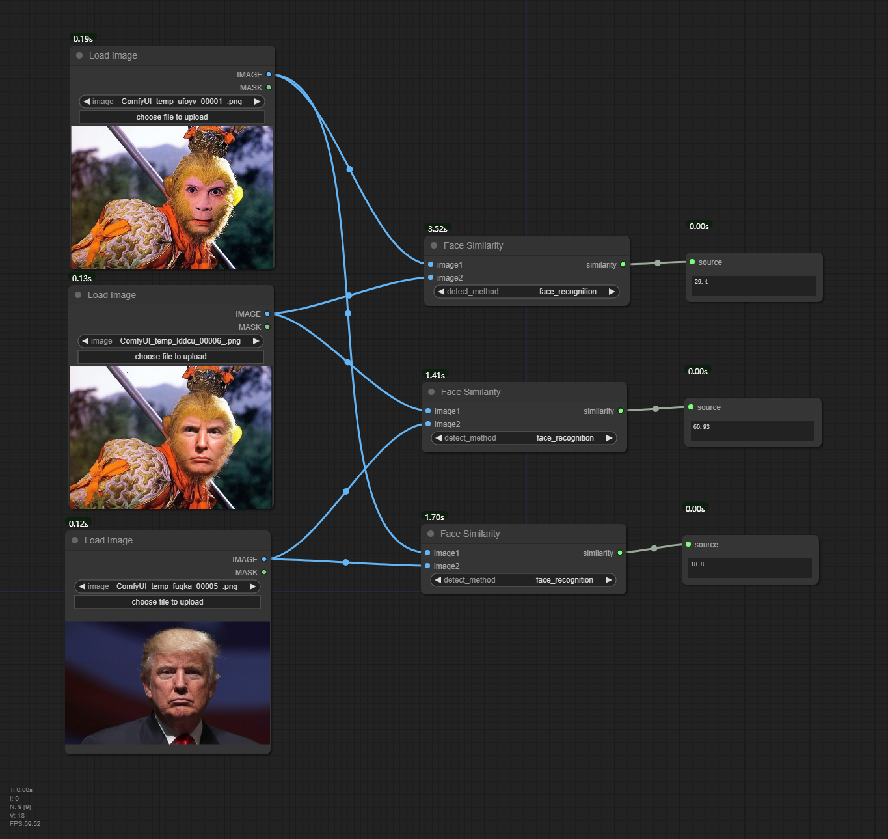

# ComfyUI Face Similarity


A custom node for ComfyUI. It compare two images to rate facial similarity.


### Node Description:
Input: Two images
Output: A float value, range from 0 to 100, and the larger the value means higher the similarity. usually, exceeding 50 is considered very similar.

  


## How to install 


* Open the cmd window in the plugin directory of ComfyUI, like ```ComfyUI\custom_nodes```，type    
```
git clone https://github.com/chflame163/ComfyUI_FaceSimilarity.git
```
* Or download the zip file and extracted, copy the resulting folder to ```ComfyUI\custom_ Nodes```    

* Install ```dlib``` dependency package. Open the cmd window in the ComfyUI_LayerStyle plugin directory like    
```ComfyUI\custom_ Nodes\ComfyUI_LayerStyle```, If it is the latest official ComfyUI portable package, please enter:
```
..\..\..\python_embeded\python.exe -m pip install .\whl\dlib-19.24.1-cp311-cp311-win_amd64.whl
```
* Also provides ```dlib-19.22.99-cp310-cp310-win_amd64.whl``` in whl folder that is compatible with Python 3.10.x if your need.    

* Next, enter the following command to install other dependency packages
```
..\..\..\python_embeded\python.exe -m pip install -r requirements.txt
```

* Restart ComfyUI.

